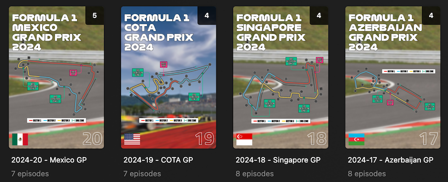

[](https://github.com/ianhaddock/motorsort/actions/workflows/test.yml)
[](https://github.com/ianhaddock/motorsort/actions/workflows/build.yml)

# MotorSort
MotorSort curates your motorsports video libraries for viewing in [PLEX][025]. MotorSort will auto-parse file names, generate event specific and _customizable_ poster and background images, and reformat filenames into a PLEX compatible folder hierarchy automatically.

<p align="center">
  
</p>

### Features
* Stateless, self contained Docker image
* Formats filenames using the PLEX compatible, [Absolute-Series-Scanner][024] convention
* Saves space by linking source files with the option to copy
* Sorts media by race series, weekend, and session
* Detects alternative event sessions, including sprint weekends
* Generates poster images with race series, event name, year, country flag, track map, and event number
* Generates background images with race event number
* Customizable poster and background base images can be applied to individual events, full seasons, or even to one specific venue

### Uses:
* Python
* ImageMagick
* Docker
* Pytest


## Quick Start
To get started, MotorSort only needs a media volume, and a source and destination location.

```
docker run \
    -d \
    --name motorsort \
    -e MEDIA_SOURCE_PATH=/mnt/media/downloads/complete \
    -e MEDIA_DESTINATION_PATH=/mnt/media/motorsort \
    -v /mnt/my_files:/mnt/media \
    ghcr.io/ianhaddock/motorsort:latest
```

### Parameters
* `-v <your_media_path>:/mnt/media` mounts your media volume to the container at `/mnt/media`
* `-e MEDIA_SOURCE_PATH` is the source path within /mnt/media on the container
* `-e MEDIA_DESTINATION_PATH` is the destination path within /mnt/media on the container

Both source and destination should be on the _same mount point_ (drive) to allow hardlinks. If your source is on one mount point (drive) and output in on another, mount both the source and destination volumes and use `COPY_FILES='True'` (see below).

### Optional Parameters
* `-e SLEEP_SECONDS=n` check for new files every _n_ seconds. Defaults to 300 seconds (5 minutes)
* `-e SLEEP_SECONDS=0` set the container to run once and quit
* `-e COPY_FILES='True'` copy files instead of using hardlinks
* `-e CONFIG_PATH='path/to/config'` change config directory path


## PLEX Integration
MotorSort checks for new content automatically, and once configured can be left to run unattended. Each run will output brief diagnostic information into the container log:

```
$ docker logs motorsort
Mon Jun 10 18:20:55 UTC 2024: Starting
Found 166 items to process.
Found 17 sprint weekends.
Creating files.
Background: 2022-00 - Example GP
Poster: 2022-00 - Example GP
Linked: Example GP - S00E01 - Free Practice 1 [FastChannelHD 1080p].mkv
Linked: Example GP - S00E06 - Free Practice 2 [FastChannelHD 1080p].mkv
<snip>
Mon Jun 10 18:20:55 UTC 2024: Sleeping 300 seconds
```

### PLEX Library Settings
* select 'TV Shows' as the library type
* use the 'Personal Media Shows' Agent

### Absolute Series Scanner
PLEX users should install [Absolute Series Scanner][024]. This will keep PLEX from applying medatata from online sources or replacing poster images.


## Custom Images:
All images can be customized by race, season, or venue! Create a local directory with your images (see formatting below) and add it to the container as `/custom`:

```
docker run \
    -d \
    --name motorsort \
    -e MEDIA_SOURCE_PATH=/mnt/media/downloads/complete \
    -e MEDIA_DESTINATION_PATH=/mnt/media/motorsort \
    -v /mnt/my_files:/mnt/media \
    -v /mnt/my_files/custom:/custom \
    ghcr.io/ianhaddock/motorsort:latest
```

When the container starts with a custom folder available, it will be populated with the default image, flag, and track files. Any updates made in this directory will be used on the next run.

Previously generated images on the destination path will not be overwritten. Remove any pre-existing show.png and background.jpg images to generate new versions that reflect your changes.

To restore the default images stop the container, erase the local custom folder contents, and start the container again.

### Image sizes
* Poster art should be 600x900 .jpg files and will be reformatted (squished) to fit 600x900
* Background art should be 1920x1080 .jpg files and will be reformatted to fit 1920x1080
* Poster art is selected in order of track name, season, or default. e.g. COTA-poster.jpg, 2022-poster.jpg, poster.jpg
* Background art is selected in order of track name, season, or default. E.g. COTA-background.jpg, 2022-background.jpg, background.jpg


## Filename Formatting
MotorSort parses the files for specific attributes, and returns the rest of the text metadata within square brackets at the tail of the filename.

Example Structure:
```
/mnt/my_files/motorsort/Formula 1/
└── 2022-00 - Example GP
    ├── Example GP - S00E01 - Free Practice 1 [FastChannelHD 1080p 50fps X264 Multi-AOA11].mkv
    ├── Example GP - S00E02 - Quali Buildup [FastChannelHD 1080p 50fps X264 Multi-AOA11].mkv
    ├── Example GP - S00E03 - Qualifying [FastChannelHD 1080p 50fps X264 Multi-AOA11].mkv
    <snip>
    ├── background.jpg
    └── show.png
```


## Contributing
I'm always interested in learning from and helping the community. If you have additions or suggestions feel free to drop a pull request. To get started:

### Using Docker compose

A `compose.yml` file is included in the repo.

Install [Docker and docker-compose][123].

Clone the repo

`git clone https://github.com/ianhaddock/motorsort.git`

Change directory into motorsort

`cd motorsort`

Build the container via compose

`docker compose up`

You will see the demo content get processed:
```
$ docker compose up
[+] Running 0/0
[+] Running 0/1rsort  Building

<snip>

 ✔ Service motorsort                Built
 ✔ Container motorsort-motorsort-1  Created
Attaching to motorsort-1
motorsort-1  | Sat Feb  8 21:44:12 UTC 2025: Starting
motorsort-1  | Found 20 items to process.
motorsort-1  | Found 7 sprint weekends.
motorsort-1  | Creating files.
motorsort-1  | Background: 2022-00 - Example GP
motorsort-1  | Poster: 2022-00 - Example GP
motorsort-1  | Linked: Example GP - S00E01 - Free Practice 1 [FastChannelHD 1080p 50fps X264 Multi-AOA11].mkv
motorsort-1  | Linked: Example GP - S00E06 - Free Practice 2 [FastChannelHD 1080p 50fps X264 Multi-AOA11].mkv
motorsort-1  | Linked: Example GP - S00E11 - Free Practice 3 [FastChannelHD 1080p 50fps X264 Multi-AOA11].mkv

<snip>

motorsort-1  | Background: 2024-04 - 24h Le Mans
motorsort-1  | Poster: 2024-04 - 24h Le Mans
motorsort-1  | Linked: 24h Le Mans  - S04E01 - Free Practice 1 [WEB 1080p h264 Multi-AOA11].mkv
motorsort-1  | Linked: 24h Le Mans  - S04E08 - Race [WEB 1080p h264 Multi-AOA11].mkv
motorsort-1  | Linked: 24h Le Mans  - S04E10 - Race Pt3 [WEB 1080p h264 Multi-AOA11].mkv
motorsort-1  | Linked: 24h Le Mans  - S04E09 - Race Pt2 [WEB 1080p h264 Multi-AOA11].mkv
motorsort-1  | Linked: 24h Le Mans  - S04E07 - Warm Up [WEB 1080p h264 Multi-AOA11].mkv
motorsort-1  | Sat Feb  8 21:44:13 UTC 2025: Sleeping 4 seconds
motorsort-1  | ....

```

use `cmd-c` to exit.


### Running locally

This option is not recommended. ImageMagick is such a great swiss army knife of a tool it can pose a [security concern][124]. You may also see various warning messages based on the OS you are running.

If you still want to run locally you will need to change the full paths in `config/config.ini` and `app/start_motorsort.sh` to local paths your account has access to, set an env var for the config directory `export CONFIG_PATH=config`, and install `bc` and `ImageMagick` locally first.


## Test coverage

Pytest tests are available.

Configure a python virtual environment

`python -m venv venv`

Enable the venv

`source venv/bin/activate`

Install pytest dependencies

`pip install -r requirements.txt`

Run the following to get an overview

`pytest -vv -x --cov-report term-missing --cov=app tests`

Currently test coverage is 94%:

```
---------- coverage: platform darwin, python 3.10.1-final-0 ----------
Name                  Stmts   Miss  Cover   Missing
---------------------------------------------------
app/__init__.py           0      0   100%
app/motorsort.py        201     11    95%   258-260, 290, 312-313, 339-340, 346-347, 355
app/poster_maker.py      73      5    93%   9, 48-49, 152-153
---------------------------------------------------
TOTAL                   274     16    94%
```


## Donations
If you found this useful and would like to support projects like this you can buy me a coffee:

<p align="center">
<a href="https://www.buymeacoffee.com/ianhaddock" target="_blank"></a>
</p>


## Sources
* Track SVGs from [Wikimedia][021] commons.
* flag images from [lipis.dev][035].
* Poster and Background images created in [Assetto Corsa][022].
* Car models from [Race Sim Studios][023], skins found on [overtake.gg][031].
* [Motion Control Neue][032] font from [ffonts.net][029].
* [Titillium Web][033] from [Google Fonts][034].
* Racing font set from [Smithographic][026] free font collection.
* [Chavelite][027] and [AliciOne Demo][028] from [ffonts.net][029].


[021]: https://commons.wikimedia.org/w/index.php?fulltext=1&profile=advanced&search=%E3%81%94%E3%81%B2%E3%82%87%E3%81%86%E3%81%86%E3%81%B9%E3%81%93+svg&title=Special%3ASearch&ns0=1&ns6=1&ns12=1&ns14=1&ns100=1&ns106=1
[022]:https://store.steampowered.com/app/244210/Assetto_Corsa/
[023]:https://racesimstudio.com/
[024]:https://github.com/ZeroQI/Absolute-Series-Scanner
[025]:https://www.plex.tv/
[026]:https://imjustcreative.com/category/free-font
[027]:https://www.ffonts.net/Chavelite.font.download
[028]:https://www.ffonts.net/AliciOne-Demo.font.download
[029]:https://www.ffonts.net/
[031]:https://www.overtake.gg/
[032]:https://www.ffonts.net/Motion-Control-Neue-Lite-Bold.font.download
[033]:https://fonts.google.com/specimen/Titillium+Web
[034]:https://fonts.google.com/
[035]:https://flagicons.lipis.dev/
[123]:https://docs.docker.com/compose/install/
[124]:https://www.cvedetails.com/vulnerability-list/vendor_id-1749/imagemagick.html
